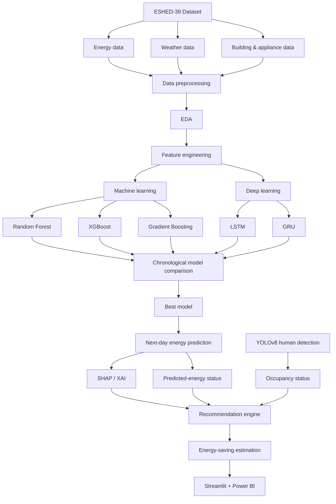

# ESHED-39: Professional Project Workflow

## Professional operating rules

1. **Data preprocessing:** remove exact duplicates; parse dates; retain only the latest five years; impute missing numeric values by each house's median; impute categorical values as `unknown`; never delete records merely to obtain a convenient sample.
2. **EDA:** generate descriptive statistics, missing-value report, daily trend, monthly seasonality, outlier review, and correlation heatmap. Perform this only on cleaned data; document all observations rather than changing data solely to improve metrics.
3. **Feature engineering:** calendar features, house-aware lag-1/lag-7 demand, seven-day rolling mean, weather and building/appliance information. The target is **next-day kWh**. Lag features use only preceding days to prevent target leakage.
4. **Evaluation protocol:** chronological 70/15/15 train/validation/test split. Never shuffle dates, tune on the test set, or compare models using different test records.
5. **Model selection:** compare RF, XGBoost, GB, LSTM, and GRU with MAE, RMSE, MAPE, and R². Select the final model based primarily on lowest test RMSE, then MAE and operational interpretability.
6. **XAI:** produce SHAP global importance for the best tabular ML model and permutation importance as a robust fallback. Explain relationships, not causality.
7. **YOLO integration:** train YOLOv8 on the separately annotated person dataset, evaluate mAP50/mAP50-95, and join detection events only where home/camera and timestamp match the energy record. A detection does not prove a person is continuously present.
8. **Recommendations and saving estimate:** recommendations are safe, rule-based actions. Calculate `estimated_saving_kwh = max(0, predicted_kwh - baseline_kwh) × achievable_reduction_rate`; label the rate as an assumption and never present it as measured saving without a pilot study.

## Project outputs

| Stage | Deliverable |
|---|---|
| Cleaning | `data/processed/energy_model_data.csv`, data profile |
| EDA | descriptive tables and four EDA figures in `reports/` |
| ML/DL | five prediction files, metrics JSON, trained models |
| Comparison | `reports/all_model_comparison.csv`, `five_model_comparison.png` |
| XAI | SHAP image and `permutation_importance.csv` |
| Decisions | `recommendations.csv` and Power BI/Streamlit dashboards |
